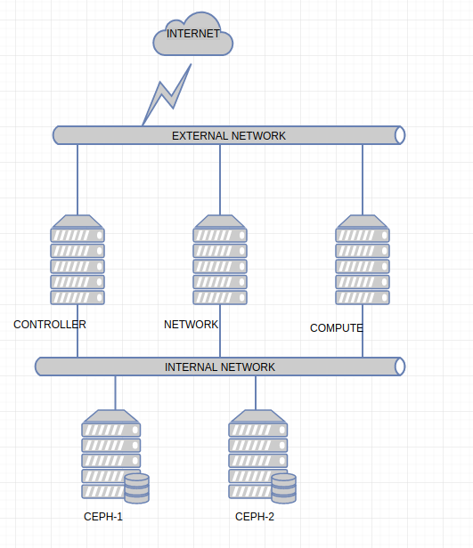
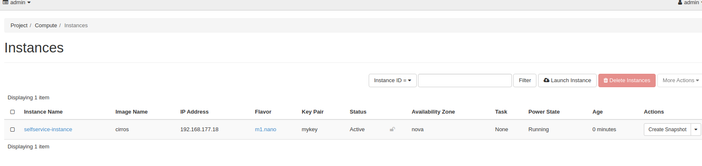
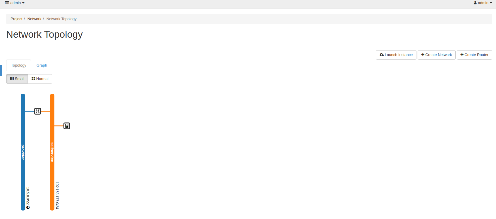
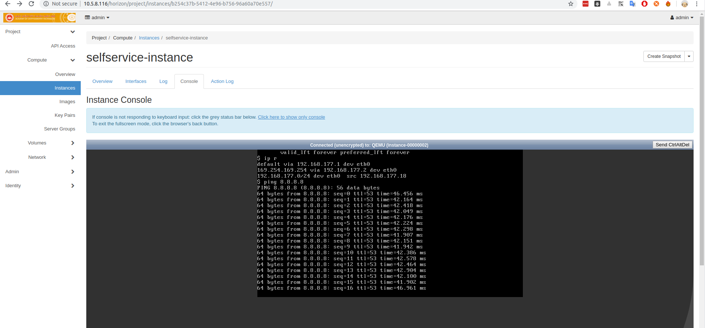

# OPENSTACK STEIN INSTALL


 


- Mô hình lab openstack Stein với cinder backend là CEPH Mimic

- Controller node, Network node và Compute node sử dụng OS Ubuntu 18.04

- CEPH cài trên CentOS 7

- Cài đặt theo thứ tự controller -> network -> compute. Sau khi cài đặt xong tiến hành các bước dưới

- Khởi tạo network provider:

```
openstack network create  --share --external --provider-physical-network provider --provider-network-type flat provider
```

- Khởi tạo subnet:

```
openstack subnet create --network provider --allocation-pool start=10.5.9.180,end=10.5.9.189 \
  --dns-nameserver 8.8.8.8 --gateway 10.5.8.1 \
  --subnet-range 10.5.8.0/22 provider
```

- Khởi tại tenant network:

```
openstack network create selfservice
openstack subnet create --network selfservice \
  --dns-nameserver 8.8.8.8 --gateway 192.168.177.1 \
  --subnet-range 192.168.177.0/24 selfservice
```

- Khởi tạo flavor:

```
root@controller-stein:~# openstack flavor create --id 0 --vcpus 1 --ram 64 --disk 1 m1.nano
+----------------------------+---------+
| Field                      | Value   |
+----------------------------+---------+
| OS-FLV-DISABLED:disabled   | False   |
| OS-FLV-EXT-DATA:ephemeral  | 0       |
| disk                       | 1       |
| id                         | 0       |
| name                       | m1.nano |
| os-flavor-access:is_public | True    |
| properties                 |         |
| ram                        | 64      |
| rxtx_factor                | 1.0     |
| swap                       |         |
| vcpus                      | 1       |
+----------------------------+---------+
```

- tạo keypair:

```
ssh-keygen -q -N ""
openstack keypair create --public-key ~/.ssh/id_rsa.pub mykey
```

- Tạo Sec group:

```
openstack security group rule create --proto icmp default
```

- Tạo VM selfservice network:

```
openstack server create --flavor m1.nano --image cirros \
  --nic net-id=cc4b2ede-7f3d-451f-985b-65127b482e96 --security-group default \
  --key-name mykey selfservice-instance
```

- Khởi tạo router để VM ra internet

```
root@controller-stein:~# openstack router create router
+-------------------------+-----------------------------------------------------------------------------------------------------------------------------------------------------------------------------------+
| Field                   | Value                                                                                                                                                                             |
+-------------------------+-----------------------------------------------------------------------------------------------------------------------------------------------------------------------------------+
| admin_state_up          | UP                                                                                                                                                                                |
| availability_zone_hints |                                                                                                                                                                                   |
| availability_zones      |                                                                                                                                                                                   |
| created_at              | 2019-10-07T12:47:14Z                                                                                                                                                              |
| description             |                                                                                                                                                                                   |
| distributed             | False                                                                                                                                                                             |
| external_gateway_info   | None                                                                                                                                                                              |
| flavor_id               | None                                                                                                                                                                              |
| ha                      | True                                                                                                                                                                              |
| id                      | 020979d0-0451-476f-8ded-7baf08ef436c                                                                                                                                              |
| location                | Munch({'cloud': '', 'region_name': '', 'zone': None, 'project': Munch({'id': 'f04eaf5178eb40d7a44c6b77af183d25', 'name': 'admin', 'domain_id': None, 'domain_name': 'Default'})}) |
| name                    | router                                                                                                                                                                            |
| project_id              | f04eaf5178eb40d7a44c6b77af183d25                                                                                                                                                  |
| revision_number         | 2                                                                                                                                                                                 |
| routes                  |                                                                                                                                                                                   |
| status                  | ACTIVE                                                                                                                                                                            |
| tags                    |                                                                                                                                                                                   |
| updated_at              | 2019-10-07T12:47:15Z                                                                                                                                                              |
+-------------------------+-----------------------------------------------------------------------------------------------------------------------------------------------------------------------------------+
root@controller-stein:~# openstack router add subnet router selfservice
root@controller-stein:~# openstack router set router --external-gateway provider
```

- Boot VM thành công:



- Khởi tạo router thành công



- Login VM qua màn hình console và ping ra được internet:

 