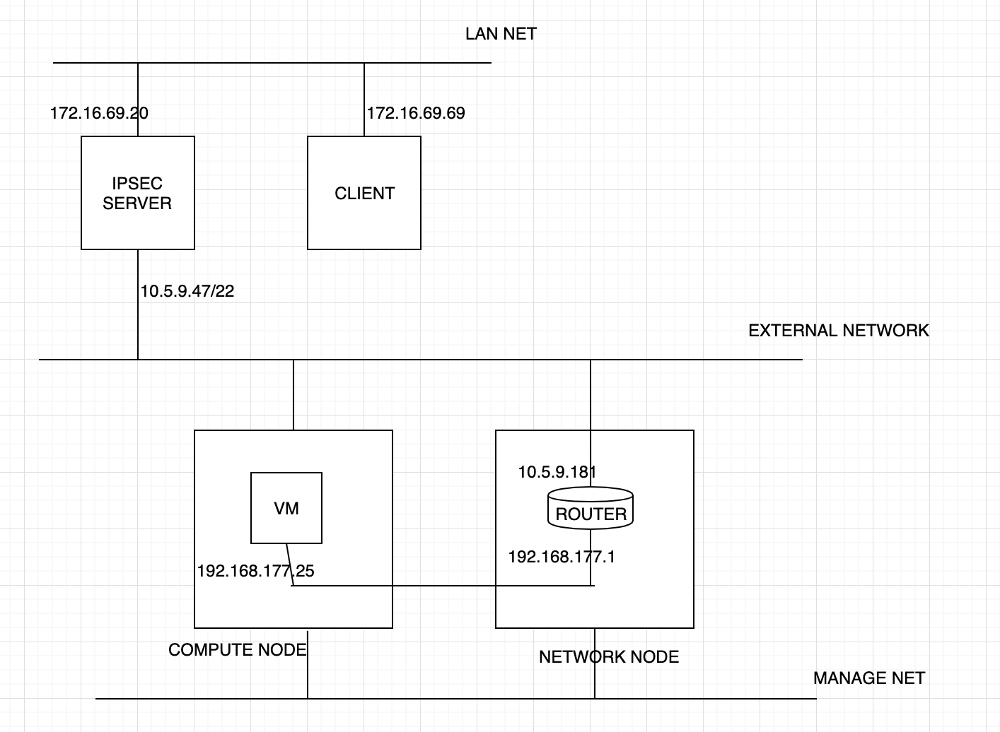
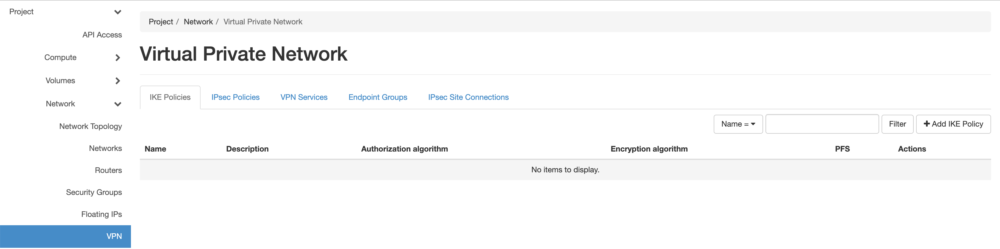

- VPNaaS là 1 extension của neutron sử dụng router của l3-agent làm gateway cho VPN.

- Mô hình lab:

 


- Trên neutron-server và network-node:

```
apt install -y python3-neutron-vpnaas
```

- Khi cài đặt gói trên thì sẽ tự động cài các gói depent lquan đến vpn:

```
libcharon-standard-plugins libstrongswan libstrongswan-standard-plugins neutron-vpnaas-common strongswan strongswan-charon strongswan-libcharon strongswan-starter
```

- Chỉnh sửa config trong <i>/etc/neutron/neutron.conf</i> để enable neutron-vpnaas module:

```
[DEFAULT]
service_plugins = neutron.services.qos.qos_plugin.QoSPlugin, router, vpnaas
[service_providers]
service_provider = VPN:strongswan:neutron_vpnaas.services.vpn.service_drivers.ipsec.IPsecVPNDriver:default
```

- Upgrade DB neutron cho neutron-vpnaas

```
neutron-db-manage --subproject neutron-vpnaas upgrade head
```

- Restart service trên controller:

```
service neutron-server restart
```

-  Trên network-node cấu hình <i>/etc/neutron/l3_agent.ini</i>:

```
[agent]
extensions = vpnaas
[ovs]
[vpnagent]
vpn_device_driver = neutron_vpnaas.services.vpn.device_drivers.strongswan_ipsec.StrongSwanDriver
```

- Restart service l3_agent:

```
service neutron-l3-agent restart
```

- Cài đặt horizon vpnaas dashboard:

```
git clone https://github.com/openstack/neutron-vpnaas-dashboard -b stable/stein
cd neutron-vpnaas-dashboard/
pip3 install -r requirements.txt
cp neutron_vpnaas_dashboard/enabled/_7100_project_vpn_panel.py /usr/share/openstack-dashboard/openstack_dashboard/local/enabled/
python3 /usr/share/openstack-dashboard/manage.py collectstatic
python3 /usr/share/openstack-dashboard/manage.py compress
```

- Restart service:

```
service apache2 restart
```

- Trên dashboard kiểm tra mục VPN ở phần network:

 


- Tạo ike policy, mặc định sẽ dùng aes-128, sha1:

```
openstack vpn ike policy create ikepolicy
+-------------------------------+--------------------------------------+
| Field                         | Value                                |
+-------------------------------+--------------------------------------+
| Authentication Algorithm      | sha1                                 |
| Description                   |                                      |
| Encryption Algorithm          | aes-128                              |
| ID                            | 91059cfd-bf4f-4a28-87b5-b7c1f312b22e |
| IKE Version                   | v1                                   |
| Lifetime                      | {'units': 'seconds', 'value': 3600}  |
| Name                          | ikepolicy                            |
| Perfect Forward Secrecy (PFS) | group5                               |
| Phase1 Negotiation Mode       | main                                 |
| Project                       | f04eaf5178eb40d7a44c6b77af183d25     |
| project_id                    | f04eaf5178eb40d7a44c6b77af183d25     |
+-------------------------------+--------------------------------------+
```

- Tạo ipsec policy, mặc định neutron sẽ dùng giao thức esp:

```
openstack vpn ipsec policy create ipsecpolicy
+-------------------------------+--------------------------------------+
| Field                         | Value                                |
+-------------------------------+--------------------------------------+
| Authentication Algorithm      | sha1                                 |
| Description                   |                                      |
| Encapsulation Mode            | tunnel                               |
| Encryption Algorithm          | aes-128                              |
| ID                            | 7a4be40a-7a57-4927-88d1-de46d547bdce |
| Lifetime                      | {'units': 'seconds', 'value': 3600}  |
| Name                          | ipsecpolicy                          |
| Perfect Forward Secrecy (PFS) | group5                               |
| Project                       | f04eaf5178eb40d7a44c6b77af183d25     |
| Transform Protocol            | esp                                  |
| project_id                    | f04eaf5178eb40d7a44c6b77af183d25     |
+-------------------------------+--------------------------------------+
```

- Tạo VPN với router đã tạo trước đó:

```
openstack vpn service create vpn \
  --router router
+----------------+--------------------------------------+
| Field          | Value                                |
+----------------+--------------------------------------+
| Description    |                                      |
| Flavor         | None                                 |
| ID             | 4f1b29de-c613-4a1d-95d7-39196887edae |
| Name           | vpn                                  |
| Project        | f04eaf5178eb40d7a44c6b77af183d25     |
| Router         | 020979d0-0451-476f-8ded-7baf08ef436c |
| State          | True                                 |
| Status         | ACTIVE                               |
| Subnet         | None                                 |
| external_v4_ip | 10.5.9.181                           |
| external_v6_ip | None                                 |
| project_id     | f04eaf5178eb40d7a44c6b77af183d25     |
+----------------+--------------------------------------+
```

- Tạo endpoint group local với subnet là subnet của dải selfservice( gre network):

```
openstack vpn endpoint group create ep_subnet \
  --type subnet \
  --value 27d333fd-cf45-4d53-89a9-4cf7cfc0b103
+-------------+------------------------------------------+
| Field       | Value                                    |
+-------------+------------------------------------------+
| Description |                                          |
| Endpoints   | ['27d333fd-cf45-4d53-89a9-4cf7cfc0b103'] |
| ID          | ed23a0ad-7742-4c62-9964-18977080f2cb     |
| Name        | ep_subnet                                |
| Project     | f04eaf5178eb40d7a44c6b77af183d25         |
| Type        | subnet                                   |
| project_id  | f04eaf5178eb40d7a44c6b77af183d25         |
+-------------+------------------------------------------+
```

- Tạo peer endpoint group với endpoint là cidr dải private network site đối diện:

```
openstack vpn endpoint group create ep_cidr \
  --type cidr \
  --value 172.16.69.20/24
+-------------+--------------------------------------+
| Field       | Value                                |
+-------------+--------------------------------------+
| Description |                                      |
| Endpoints   | ['172.16.69.20/24']                  |
| ID          | 1962f2aa-b061-4350-a72d-8a98afa642ae |
| Name        | ep_cidr                              |
| Project     | f04eaf5178eb40d7a44c6b77af183d25     |
| Type        | cidr                                 |
| project_id  | f04eaf5178eb40d7a44c6b77af183d25     |
+-------------+--------------------------------------+
```

- Khởi tạo kết nối VPN:

```
openstack vpn ipsec site connection create conn \
  --vpnservice vpn \
  --ikepolicy ikepolicy \
  --ipsecpolicy ipsecpolicy \
  --peer-address 10.5.9.47 \
  --peer-id 10.5.9.47 \
  --psk secret \
  --local-endpoint-group ep_subnet \
  --peer-endpoint-group ep_cidr

+--------------------------+----------------------------------------------------+
| Field                    | Value                                              |
+--------------------------+----------------------------------------------------+
| Authentication Algorithm | psk                                                |
| Description              |                                                    |
| ID                       | 195e0f2b-f34e-4721-bb00-22cd33e97d59               |
| IKE Policy               | 91059cfd-bf4f-4a28-87b5-b7c1f312b22e               |
| IPSec Policy             | 7a4be40a-7a57-4927-88d1-de46d547bdce               |
| Initiator                | bi-directional                                     |
| Local Endpoint Group ID  | ed23a0ad-7742-4c62-9964-18977080f2cb               |
| Local ID                 |                                                    |
| MTU                      | 1500                                               |
| Name                     | conn                                               |
| Peer Address             | 10.5.9.47                                          |
| Peer CIDRs               |                                                    |
| Peer Endpoint Group ID   | 1962f2aa-b061-4350-a72d-8a98afa642ae               |
| Peer ID                  | 10.5.9.47                                          |
| Pre-shared Key           | secret                                             |
| Project                  | f04eaf5178eb40d7a44c6b77af183d25                   |
| Route Mode               | static                                             |
| State                    | True                                               |
| Status                   | PENDING_CREATE                                     |
| VPN Service              | 4f1b29de-c613-4a1d-95d7-39196887edae               |
| dpd                      | {'action': 'hold', 'interval': 30, 'timeout': 120} |
| project_id               | f04eaf5178eb40d7a44c6b77af183d25                   |
+--------------------------+----------------------------------------------------+
```


- Cài đặt, cấu hình IPSEC trên ipsec server và restart service strongswan:

```
apt install strongswan strongswan-pki
root@levtolstoy:~# cat /etc/ipsec.conf
config setup

conn %default
        keylife=20m
        rekeymargin=3m
        keyingtries=1
        authby=psk
        mobike=no

conn conn-to-vpnaas
    keyexchange=ikev1
    left=10.5.9.47
    leftsubnet=172.16.69.20/24
    leftid=10.5.9.47
    leftfirewall=yes
    right=10.5.9.181
    rightsubnet=192.168.177.0/24
    rightid=10.5.9.181
    auto=route
    dpdaction=hold
    dpddelay=30s
    dpdtimeout=120s
    ike=aes128-sha1-modp1536
    ikelifetime=3600s
    esp=aes128-sha1-modp1536
    lifetime=3600s
    type=tunnel
root@levtolstoy:~# cat /etc/ipsec.secrets
# This file holds shared secrets or RSA private keys for authentication.

# RSA private key for this host, authenticating it to any other host
# which knows the public part.
# source      destination
10.5.9.47 10.5.9.181 : PSK "secret"
```

- Kiểm tra kết nối IPSEC server:

```
root@levtolstoy:~# ipsec status
Routed Connections:
conn-to-vpnaas{1}:  ROUTED, TUNNEL, reqid 1
conn-to-vpnaas{1}:   172.16.69.0/24 === 192.168.177.0/24
Security Associations (1 up, 0 connecting):
conn-to-vpnaas[1]: ESTABLISHED 35 minutes ago, 10.5.9.47[10.5.9.47]...10.5.9.181[10.5.9.181]
conn-to-vpnaas{4}:  INSTALLED, TUNNEL, reqid 1, ESP SPIs: c3d108d3_i c9edf14f_o
conn-to-vpnaas{4}:   172.16.69.0/24 === 192.168.177.0/24
```

- Tiến hành ping thử giữa các client 2 site với nhau:

 


###  Phân tích gói tin qua VPN với Wireshark:

-   Trên 1 máy thuộc mạng Lan bên remote (172.16.69.29/24). mở cổng HTTP 80:

 

- Tạo 1 VM trên OPS thuộc dải 192.168.177.0/24 và thử kết nối đến 172.16.69.29:80 :

 

- Trên q-router đặt tcpdump để bắt trafic qua VPN:

```
ip netns e qrouter-020979d0-0451-476f-8ded-7baf08ef436c tcpdump  -i qg-239ba6a1-39 -vvv host 10.5.9.47
```

- Kết quả có được:


- Phân tích file pcap với wireshark:

